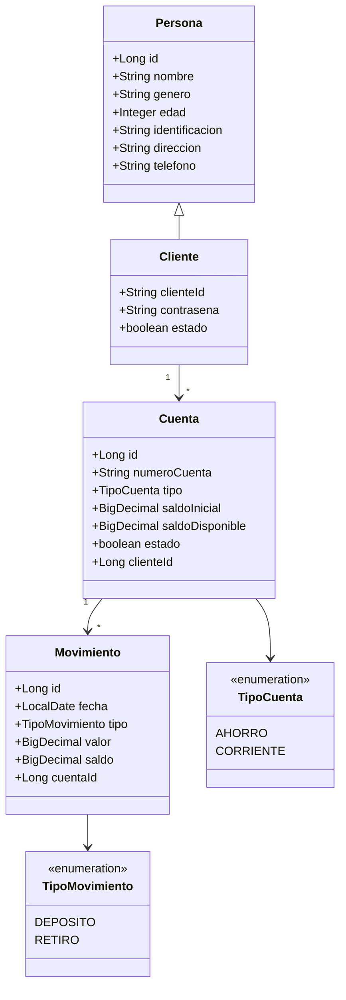
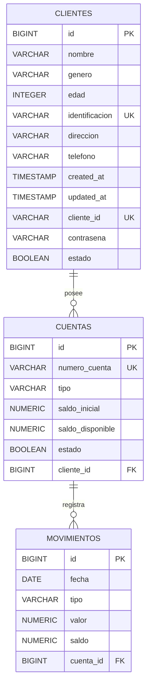

# Esquemas de Modelo y Base de Datos

Este documento resume visualmente la estructura principal de la solucion backend: modelo funcional y esquema relacional.

## 1. Modelo de dominio

## 2. Esquema relacional de base de datos

## 3. Script SQL principal

El esquema relacional entregado oficialmente para la prueba se encuentra en:

- [BaseDatos.sql](</C:/Users/naren/OneDrive/Desktop/Naren Unicauca/CHAMBA/PruebaTecnicaDevsuNimbachi/banco-app/BaseDatos.sql>)

Ese archivo contiene:

- creacion de tablas
- claves primarias
- claves foraneas
- restricciones
- indices
- datos semilla de ejemplo

## 4. Correspondencia entre codigo y base de datos

Relaciones implementadas en el proyecto:

- `ClienteEntity` se mapea a la tabla `clientes`
- `CuentaEntity` se mapea a la tabla `cuentas`
- `MovimientoEntity` se mapea a la tabla `movimientos`
- `PersonaEntity` es una superclase mapeada con `@MappedSuperclass`

Relaciones JPA principales:

- un cliente tiene muchas cuentas
- una cuenta pertenece a un cliente
- una cuenta tiene muchos movimientos
- un movimiento pertenece a una cuenta

## 5. Observacion sobre el script SQL

Aunque el proyecto usa JPA e Hibernate, el archivo `BaseDatos.sql` se incluye porque:

- el enunciado lo pide expresamente
- deja un esquema reproducible e independiente del auto-DDL
- facilita validar la solucion en otro computador
- muestra de forma explicita las restricciones de la base de datos
